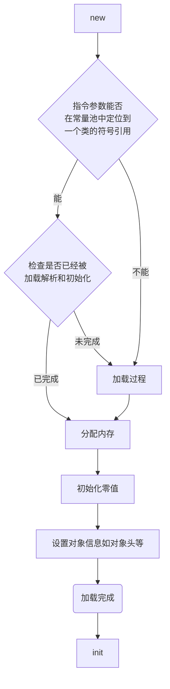
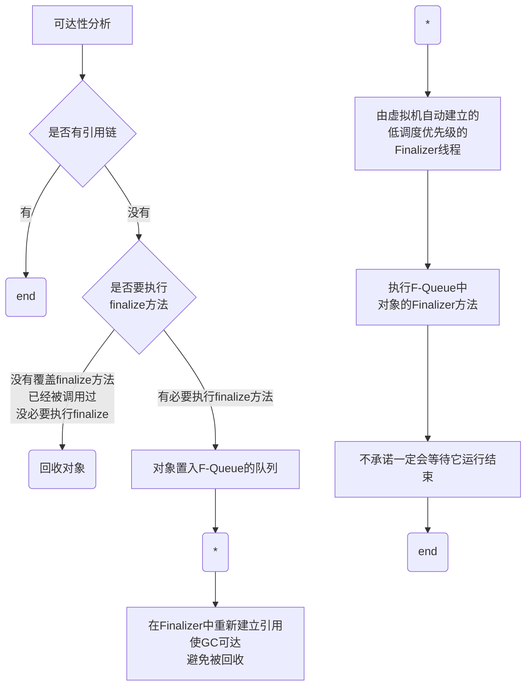

# jvm 内存管理


## 1. Java内存区域与内存溢出异常

### 1.1 运行时数据区域

对于运行时数据区域被划分为5个区域，***方法区（Method Area）*** ,**虚拟机栈（VM Stack）**, **本地方法栈（Native Method Stack)**, ***堆（Heap）***，**程序计数器（Program Counter Register)**

方法区 和 堆 由所有线程共享，其他是线程隔离的。


#### 1.1.1 程序计数器

**当前线程所执行的字节码的行号指示器**

- 字节码解释器工作时就是通过改变这个计数器的值来选取下一条需要执行的字节码指令
- Java虚拟机的多线程是通过线程轮流切换、分配处理器执行时间的方式来实现的，所以需要每个线程独立存储自己的指示器
- 线程执行Java方法时，这个计数器记录的是正在执行的虚拟机字节码指令的地址；
- 线程执行的是本地（Native）方法，这个计数器值则应为空（Undefined）

<!--more--> >>

#### 1.1.2 Java虚拟机栈

**虚拟机栈描述的是Java方法执行的线程内存模型**

- Java虚拟机都会同步创建一个**栈帧**（Stack Frame）用于存储**局部变量表、操作数栈、动态连接、方法出口**等信息。
- 每一个方法被调用直至执行完毕的过程，就对应着一个栈帧在虚拟机栈中从入栈到出栈的过程
- 局部变量表：
  - 存放**Java虚拟机基本数据类型**（boolean、byte、char、short、int、float、long、double）、**对象引用**（reference类型，它并不等同于对象本身，可能是一个指向对象起始地址的引用指针，也可能是指向一个代表对象的句柄或者其他与此对象相关的位置）和r**eturnAddress类型**（指向了一条字节码指令的地址）
  - 局部变量表中的存储空间以**局部变量槽（Slot）**来表示
  - 局部变量表在**编译期间完成空间分配**，在方法运行期间**不会改变局部变量表的大小（slot的数量，而slot的大小又虚拟机决定）**
- **线程请求的栈深度大于虚拟机所允许的深度，将抛出StackOverflowError异常**；
- **Java虚拟机栈容量可以动态扩展，当栈扩展时无法申请到足够的内存会抛出OutOfMemoryError异常**


#### 1.1.3 本地方法栈

本地方法栈（Native Method Stacks）与虚拟机栈所发挥的作用类似，只是虚拟机栈为虚拟机**执行Java方法（也就是字节码）服务**，而本地方法栈则是为虚拟机使用到的**本地（Native）方法服务**。

- **本地方法栈也会在栈深度溢出或者栈扩展失败时分别抛出StackOverflowError和OutOfMemoryError异常**


#### 1.1.4 Java堆

- Java堆（Java Heap）是虚拟机所管理的**内存中最大的一块**
- **所有线程共享，在虚拟机启动时创建**
- 目的就是存放对象实例
- Java堆是**垃圾收集器管理的内存区域**，因此一些资料中它**也被称作“GC堆”**（Garbage Collected Heap，幸好国内没翻译成“垃圾堆”）
- 所有线程共享的Java堆中可以划分出多个线程私有的分配缓冲区（Thread Local Allocation Buffer，TLAB），以提升对象分配时的效率。
- Java堆可以处于物理上不连续的内存空间中，但在逻辑上它应该被视为连续的
- 如果在Java堆中**没有内存完成实例分配，并且堆也无法再扩展时**，Java虚拟机将会抛出OutOfMemoryError异常。


#### 1.1.5 方法区

**方法区（Method Area）与Java堆一样，是各个线程共享的内存区域，它用于存储已被虚拟机加载的类型信息、常量、静态变量、即时编译器编译后的代码缓存等数据。**

- 这区域的内存回收目标主要是针对常量池的回收和对类型的卸载
- **方法区无法满足新的内存分配需求时，将抛出OutOfMemoryError异常**


##### 1.1.5.1 运行时常量池

**运行时常量池（Runtime Constant Pool）是方法区的一部分**

- 类加载后，会从类中加载**编译期生成的各种字面量与符号引用(class文件中)**到方法区的运行时常量池中
- 运行时常量池相对于Class文件常量池的另外一个重要特征是具备动态性
- 运行期间也可以将新的常量放入池中，这种特性被开发人员利用得比较多的便是String类的intern()方法。
- 当常量池无法再申请到内存时会抛出OutOfMemoryError异常


##### 1.1.5.2 直接内存

- 直接内存（Direct Memory）并不是虚拟机运行时数据区的一部分，也不是《Java虚拟机规范》中定义的内存区域。
- 本机直接内存的分配不会受到Java堆大小的限制


### 1.2 HotSpot虚拟机对象探秘

#### 1.2.1 对象的创建





- 在堆上分配内存（空间问题）
  - 堆内存是规整的：采用**“指针碰撞”（Bump The Pointer）**的分配方式
  - 堆内存不规整的：采用**“空闲列表”（Free List）**的分配方式
  - 堆内存的规整与否，由所采用的垃圾收集器是否带有空间压缩整理（Compact）的能力决定
  - Serial、ParNew等带压缩整理过程的收集器时，系统采用的分配算法是指针碰撞，既简单又高效；
  - 而当使用CMS这种基于清除（Sweep）算法的收集器时，理论上就只能采用较为复杂的空闲列表来分配内存
- 在堆上分配内存（同步问题）
  - 一种是对分配内存空间的动作进行同步处理——实际上虚拟机是采用CAS配上失败重试的方式保证更新操作的原子性；
  - 另外一种是把内存分配的动作按照线程划分在不同的空间之中进行，即每个线程在Java堆中预先分配一小块内存，称为**本地线程分配缓冲（Thread Local Allocation Buffer，TLAB）**，哪个线程要分配内存，就在哪个线程的本地缓冲区中分配，只有本地缓冲区用完了，**分配新的缓存区时才需要同步锁定**。虚拟机是否使用TLAB，可以通过-XX：+/-UseTLAB参数来设定
- 虚拟机必须将分配到的内存空间（但不包括对象头）都初始化为**零值**，如果使用了TLAB的话，这一项工作也可以提前至TLAB分配时顺便进行。**保证能使用零值**
- Java虚拟机还要对对象进行必要的设置
- **从虚拟机的视角来看，一个新的对象已经产生了。但是从Java程序的视角看来，对象创建才刚刚开始——构造函数**


#### 1.2.2 对象的内存布局

对象在堆内存中的存储布局可以划分为三个部分：**对象头（Header）、实例数据（Instance Data）和对齐填充（Padding）**


##### 1.2.2.1 对象头

- 存储对象自身的运行时数据：**Mark Word**
  - 哈希码（HashCode）、GC分代年龄、锁状态标志、线程持有的锁、偏向线程ID、偏向时间戳等
- 对象头的另外一部分是类型指针：**Klass Point**
  - 对象指向它的类元数据的指针，虚拟机通过这个指针来确定这个对象是哪个类的实例
  - **但是**，查找对象的元数据信息并不一定要经过对象本身


##### 1.2.2.2 实例数据

**对象真正存储的有效信息**,即我们在程序代码里面所定义的各种类型的字段内容，无论是从父类继承下来的，还是在子类中定义的字段都必须记录起来

- 存储顺序会受到虚拟机分配策略参数（-XX：FieldsAllocationStyle参数）和字段在Java源码中定义顺序的影响
  - HotSpot虚拟机默认的分配顺序为longs/doubles、ints、shorts/chars、bytes/booleans、oops（Ordinary Object Pointers，OOPs）
  - HotSpot虚拟机的+XX：CompactFields参数值为true（默认就为true），那子类之中较窄的变量也允许插入父类变量的空隙之中，以节省出一点点空间


##### 1.2.2.3 对齐填充

**不是必然存在的，也没有特别的含义，它仅仅起着占位符的作用**

> HotSpot虚拟机的自动内存管理系统要求对象起始地址必须是8字节的整数倍，换句话说就是任何对象的大小都必须是8字节的整数倍。对象头部分已经被精心设计成正好是8字节的倍数（1倍或者2倍），因此，如果对象实例数据部分没有对齐的话，就需要通过对齐填充来补全


#### 1.2.3 对象的访问定位

**Java程序会通过栈上的reference数据来操作堆上的具体对象**

- 主流的访问方式主要有使用**句柄**和**直接指针**两种：
  - 句柄：堆中将可能会划分出一块内存来作为句柄池，reference中存储的就是对象的句柄地址，而句柄中包含了对象实例数据与类型数据各自具体的地址信息
  - 直接指针：Java堆中对象的内存布局就必须考虑如何放置访问类型数据的相关信息，reference中存储的直接就是对象地址（HotSpot 使用的方式）
  - 句柄稳定，而直接指针开销少


### 1.3 OutOfMemoryError 异常检查

#### 1.3.1 Java堆溢出

- 堆溢出：
  - 不断创建对象
  - 使创建的对象保持GC Root 可达
  - java.lang.OutOfMemoryError:Java heap space
  - 通过参数**-XX：+HeapDumpOnOutOf-MemoryError**可以让虚拟机在出现内存溢出异常的时候Dump出当前的内存堆转储快照以便进行事后分析

- 简要检查步骤：
  - 到底是出现了**内存泄漏（Memory Leak）**还是**内存溢出（Memory Overflow）**
  - 内存泄漏：查看泄漏对象到GC Roots的引用链，找到泄漏对象是通过怎样的引用路径、与哪些GC Roots相关联
  - 内存溢出：检查Java虚拟机的堆参数（-Xmx与-Xms）设置


#### 1.3.2 虚拟机栈和本地方法栈溢出


- 溢出原因：
  - 如果线程请求的栈深度大于虚拟机所允许的最大深度，将抛出StackOverflowError异常。
  - 如果虚拟机的栈内存允许动态扩展，当扩展栈容量无法申请到足够的内存时，将抛出OutOfMemoryError异常。
- 溢出场景：
  - 使用-Xss参数减少栈内存容量
  - 定义了大量的本地变量，增大此方法帧中本地变量表的长度
- 检查：
  - 出现StackOverflowError异常时，会有明确错误堆栈可供分析，相对而言比较容易定位到问题所在


#### 1.3.3 方法区和运行时常量池溢出

- 溢出原因（常量池）：
  - JDK 6 之前包括JDK 6 
    - JDK 6 之前包括JDK 6 的HotSpot虚拟机中，常量池都是分配在永久代中，可以通过-XX：PermSize和-XX：MaxPermSize限制永久代的大小，即可间接限制其中常量池的容量
    - OutOfMemoryError:PermGen space
  - JDK 7或更高版本的JDK
    - JDK 7中的-XX：MaxPermSize，JDK 8及以上的-XX：MaxMeta-spaceSize 命令限制方法区容量，也都不会重现JDK 6中的溢出异常
    - **自JDK 7起，原本存放在永久代的字符串常量池被移至Java堆之中**
- 溢出原因（方法区）
  - 大量的类去填满方法区，直到溢出为止

- 异常场景：
  - 大量的常量
  - 使用到CGLib这类字节码技术，当增强的类越多，就需要越大的方法区以保证动态生成的新类型可以载入内存

>  JDK 8以后，**永久代便完全退出了历史舞台**，**元空间**作为其替代者登场。在默认设置下，前面列举的那些正常的动态创建新类型的测试用例已经**很难再迫使虚拟机产生方法区的溢出异常了**
>
>  -XX：MaxMetaspaceSize：设置元空间最大值，默认是-1，即不限制，或者说**只受限于本地内存大小**。·
>
>  -XX：MetaspaceSize：**指定元空间的初始空间大小，以字节为单位**，达到该值就会触发垃圾收集进行类型卸载，同时收集器会对该值进行调整：如果释放了大量的空间，就适当降低该值；如果释放了很少的空间，那么在不超过-XX：MaxMetaspaceSize（如果设置了的话）的情况下，适当提高该值。
>
>  -XX：MinMetaspaceFreeRatio：作用是**在垃圾收集之后控制最小的元空间剩余容量的百分比，**可减少因为元空间不足导致的垃圾收集的频率。类似的还有-XX：Max-MetaspaceFreeRatio，用于控制最大的元空间剩余容量的百分比。


#### 1.3.4 本机直接内存溢出

**直接内存（Direct Memory）的容量大小可通过-XX：MaxDirectMemorySize参数来指定，如果不去指定，则默认与Java堆最大值（由-Xmx指定）一致**

- 检查：
  - 直接内存导致的内存溢出，一个明显的特征是在Heap Dump文件中不会看见有什么明显的异常情况
  - 如果内存溢出之后产生的Dump文件很小，而程序中又直接或间接使用了 DirectMemory（典型的间接使用就是NIO），那就可以考虑重点检查一下直接内存方面的原因了


## 2. 垃圾收集器与内存分配策略

- 哪些内存需要回收？

- 什么时候回收？

- 如何回收？

### 2.1 对象是否存活


#### 2.1.1 引用计数算法（Reference Counting）

在对象中添加一个引用计数器，每当有一个地方**引用它时，计数器值就加一**；当引用**失效时，计数器值就减一**；

- 优势
  - 原理简单
  - 判定效率高

- 问题（为什么 java 没有使用引用计数器）
  - 必须要配合大量额外处理才能保证正确地工作，譬如单纯的引用计数就很难解决对象之间相互循环引用的问题，如一下代码，objA 和 objB 其实都是可以回收的，但是他们之间还是存在引用

```java
TestGc objA = new TestGc();
TestGc objB = new TestGc();
objA.instance = objB;
objB.instance = objA;
objA = null;
objB = null;
System.gc();
```


#### 2.1.2 可达性分析算法（Reachability Analysis）

这个算法的基本思路就是通过一系列称为**“GC Roots”的根对象作为起始节点集**，从这些节点开始，根据引用关系向下搜索，搜索过程所走过的路径称为**“引用链”（Reference Chain）**，如果**某个对象到GC Roots间没有任何引用链相连**，或者用图论的话来说就是从**GC Roots到这个对象不可达时**，则证明此对象是不可能再被使用的。

- 固定可作为GC Roots的对象包括以下几种
  - 在虚拟机栈（栈帧中的本地变量表）中引用的对象，譬如各个线程被调用的方法堆栈中使用到的参数、局部变量、临时变量等。
  - 在方法区中类静态属性引用的对象，譬如Java类的引用类型静态变量。
  - 在方法区中常量引用的对象，譬如字符串常量池（String Table）里的引用。
  - 在本地方法栈中JNI（即通常所说的Native方法）引用的对象。
  - Java虚拟机内部的引用，如基本数据类型对应的Class对象，一些常驻的异常对象（比如NullPointExcepiton、OutOfMemoryError）等，还有系统类加载器。
  - 所有被同步锁（synchronized关键字）持有的对象。
  - 反映Java虚拟机内部情况的JMXBean、JVMTI中注册的回调、本地代码缓存等

**根据用户所选用的垃圾收集器以及当前回收的内存区域不同，还可以有其他对象“临时性”地加入，共同构成完整GC Roots集合。**


#### 2.1.3 再谈引用

java 中引用的传统定义导致引用只有“被引用”或者“未被引用”两种状态，JDK 1.2版之后，Java对引用的概念进行了扩充，将引用分为**强引用（StronglyRe-ference）、软引用（Soft Reference）、弱引用（Weak Reference）和虚引用（Phantom Reference）**4种，

- **强引用**：
  - 显式声明：Obj A = new Obj()
  - **只要强引用关系还存在，垃圾收集器就永远不会回收掉被引用的对象**
- **软引用**：还有用，但非必须的对象
  - 使用 SoftReference 类来实现软引用
  - **系统将要发生内存溢出异常前被回收**
- **弱引用**：非必须对象
  - 使用 WeakReference 类来实现弱引用
  - **发生GC时被回收，无论是否内存溢出**
- **虚引用**：
  - 使用 PhantomReference 类来实现虚引用
  - 对象设置虚引用关联的唯一目的只是为了能在这个对象**被收集器回收时收到一个系统通知**


#### 2.1.4 对象是否存活？

**即使在可达性分析算法中判定为不可达的对象，也不是“非死不可”的**




在finalizer()中重新被引用，**可能（finalizer()不一定被执行）**可以避免被回收，前提得在二次标记之前执行 finalizer()，所以对象在**执行了 finalizer() 之后不一定被回收**

而任何一个对象的 **finalize() 方法都只会被系统自动调用一次**，如果对象面临下一次回收，它的finalize()方法不会被再次执行

> finalize()的运行代价高昂，不确定性大，无法保证各个对象的调用顺序，如今已被官方明确声明为不推荐使用的语法。
>
> 建议完全可以忘掉Java语言里面finalize()的这个方法


#### 2.1.5 回收方法区

主要回收两部分内容：**废弃的常量和不再使用的类型**

- 回收废弃常量与回收Java堆中的对象非常类似
  - 虚拟机中也没有其他地方引用这个字面量
- 判定一个类型是否属于“不再被使用的类”的条件就比较苛刻
  - 条件：
    - 该类所有的实例都已经被回收：Java堆中不存在该类及其任何派生子类的实例
    - 加载该类的类加载器已经被回收：这个条件除非是经过精心设计的可替换类加载器的场景，如OSGi、JSP的重加载等，否则通常是很难达成的
    - 该类对应的java.lang.Class对象没有在任何地方被引用，无法在任何地方通过反射访问该类的方法
  - 满足上述三个条件的无用类也只是允许被回收
    - HotSpot虚拟机提供了-Xnoclassgc参数进行控制
    - 可以使用-verbose：class以及-XX：+TraceClass-Loading、-XX：+TraceClassUnLoading查看类加载和卸载信息
    - -verbose：class和-XX：+TraceClassLoading可以在Product版的虚拟机中使用
    - -XX：+TraceClassUnLoading参数需要FastDebug版的虚拟机支持


### 2.2 垃圾收集算法

细节方面，可以阅读RichardJones撰写的《垃圾回收算法手册》的第2～4章的相关内容

垃圾收集算法可以划分为**“引用计数式垃圾收集”（Reference Counting GC）和“追踪式垃圾收集”**（Tracing GC）两大类，这两类也常被称作“直接垃圾收集”和“间接垃圾收集”。


#### 2.2.1 分代收集理论

- 两个分代假说
  - 弱分代假说（Weak Generational Hypothesis）：绝大多数对象都是朝生夕灭的。
  - 强分代假说（Strong Generational Hypothesis）：熬过越多次垃圾收集过程的对象就越难以消亡

- 隐含的假说： 跨代引用假说（Intergenerational Reference Hypothesis）：跨代引用相对于同代引用来说仅占极少数。

- 收集概念
  - 部分收集（Partial GC）：指目标不是完整收集整个Java堆的垃圾收集，其中又分为：
    - 新生代收集（Minor GC/Young GC）：指目标只是新生代的垃圾收集。
    - 老年代收集（Major GC/Old GC）：指目标只是老年代的垃圾收集。目前只有CMS收集器会有单独收集老年代的行为。另外请注意“Major GC”这个说法现在有点混淆，在不同资料上常有不同所指，读者需按上下文区分到底是指老年代的收集还是整堆收集。
    - 混合收集（Mixed GC）：指目标是收集整个新生代以及部分老年代的垃圾收集。目前只有G1收集器会有这种行为。
    - 整堆收集（Full GC）：收集整个Java堆和方法区的垃圾收集


#### 2.2.2 标记-清除算法（Mark-Sweep）

**最早出现也是最基础的垃圾收集算法**

- 算法分为“标记”和“清除”两个阶段：
  - 标记出所有需要回收的对象，
  - 统一回收掉所有被标记的对象
- 也可以反过来，标记存活的对象，统一回收所有未被标记的对象。
- **标记过程就是对象是否属于垃圾的判定过程**

- 缺点
  - 执行效率不稳定
  - 内存空间的碎片化问题，标记、清除之后会产生大量不连续的内存碎片，空间碎片太多可能会导致当以后在程序运行过程中需要分配较大对象时无法找到足够的连续内存而不得不提前触发另一次垃圾收集动作


#### 2.2.3 标记-复制算法（半区复制：SemispaceCopying）

内存分为两块大小一样的区域，用以标记出需要回收对象后，把不用被回收的对象负责到半区中，然后清除原来半区的数据。

- 优点是清除效率提高了，也不存在空间碎片化问题
- 缺点是空间利用率变低，只有原来的一般

- **Java虚拟机大多都优先采用了这种收集算法去回收新生代**


##### 2.2.3.1 Appel式回收

> Appel式回收的具体做法是把新生代分为一块较大的Eden空间和两块较小的Survivor空间，每次分配内存只使用Eden和其中一块Survivor。发生垃圾搜集时，将Eden和Survivor中仍然存活的对象一次性复制到另外一块Survivor空间上，然后直接清理掉Eden和已用过的那块Survivor空间。HotSpot虚拟机默认Eden和Survivor的大小比例是8∶1，也即每次新生代中可用内存空间为整个新生代容量的90%（Eden的80%加上一个Survivor的10%），只有一个Survivor空间，即10%的新生代是会被“浪费”的。当然，98%的对象可被回收仅仅是“普通场景”下测得的数据，任何人都没有办法百分百保证每次回收都只有不多于10%的对象存活，因此Appel式回收还有一个充当罕见情况的“逃生门”的安全设计，当Survivor空间不足以容纳一次Minor GC之后存活的对象时，就需要依赖其他内存区域（实际上大多就是老年代）进行分配担保（Handle Promotion）。

- 新生代分为一块较大的 Eden 空间 和两块较小的 Survivor 空间 （HotSpot虚拟机默认Eden和Survivor的大小比例是8∶1）
- 每次分配内存只使用Eden和其中一块Survivor
- 发生垃圾搜集时，将Eden和Survivor中仍然存活的对象一次性**复制**到另外一块Survivor空间上，然后直接**清理**掉Eden和已用过的那块Survivor空间

- 当Survivor空间不足以容纳一次Minor GC之后存活的对象时，就需要依赖其他内存区域（实际上大多就是老年代）进行分配担保（Handle Promotion）


**默认以8:1来分配新生代空间，会得到 80%的 Eden 一个，10%的 Survivor 两个，其中 Eden 和一个 Survivor 充电新生代的作用，而剩下的 Surivivor 充当复制区，当存活的对象在复制区中放置不下时，一般会被放到老年代中**


#### 2.2.4 标记-整理算法（Mark-Compact）

其中的标记过程仍然与“标记-清除”算法一样，但后续步骤不是直接对可回收对象进行清理，而是**让所有存活的对象都向内存空间一端移动**，然后直接清理掉边界以外的内存

- 移动则内存回收时会更复杂，不移动则内存分配时会更复杂。
- 从垃圾收集的停顿时间来看，不移动对象停顿时间会更短，甚至可以不需要停顿，但是从整个程序的吞吐量来看，移动对象会更划算。

- HotSpot虚拟机里面关注吞吐量的Parallel Scavenge收集器是基于标记-整理算法的，而关注延迟的CMS收集器则是基于标记-清除算法的，这也从侧面印证这点


### 2.3 HotSpot的算法细节实现

**粗劣记录**

- 根节点枚举

  - OopMap（普通对象指针（OrdinaryObject Pointer，OOP））

- 安全点（Safepoint）

  - “特定的位置”生成OopMap，这些位置被称为安全点
  - 如何停下所有线程
    - 抢先式中断（Preemptive Suspension）：首先把所有用户线程全部中断，如果发现有用户线程中断的地方不在安全点上，就恢复这条线程执行，让它一会再重新中断，直到跑到安全点上。现在**几乎没有**虚拟机实现采用抢先式中断来暂停线程响应GC事件
    - 主动式中断（Voluntary Suspension）：设置一个标志位，各个线程执行过程时会不停地主动去轮询这个标志，一旦发现中断标志为真时就自己在最近的安全点上主动中断挂起

  > HotSpot使用内存保护陷阱的方式，虚拟机把某一位的内存页设置为不可读，那线程执行到对应指令时就会产生一个自陷异常信号，然后在预先注册的异常处理器中挂起线程实现等待

  - 安全点机制保证了程序执行时，在不太长的时间内就会遇到可进入垃圾收集过程的安全点

- 安全区域

  - 用户线程处于Sleep状态或者Blocked状态，这时候线程无法响应虚拟机的中断请求，不能再走到安全的地方去中断挂起自己
  - 增加安全区域，线程声明自己进入安全区域后，垃圾回收时就不会管它们了

- 记忆集与卡表（Remembered Set）

  - 新生代中建立了名为记忆集的数据结构，用以避免把整个老年代加进GC Roots扫描范围

- **写屏障（Write Barrier）**

  - 卡表元素如何维护的问题？
  - HotSpot虚拟机里是通过写屏障技术维护卡表状态的
  - 赋值前的部分的写屏障叫作写**前屏障（Pre-WriteBarrier）**，在赋值后的则叫作写**后屏障（Post-Write Barrier）**
  - 卡表在高并发场景下还面临着“伪共享”（False Sharing）问题
  - JDK 7之后，HotSpot虚拟机增加了一个新的参数-XX：+UseCondCardMark，用来决定是否开启卡表更新的条件判断

  

  **并发的可达性分析**

- 三色标记

  - 白色：**表示对象尚未被垃圾收集器访问过**。显然在可达性分析刚刚开始的阶段，所有的对象都是白色的，若在分析结束的阶段，仍然是白色的对象，即代表不可达。
  - 黑色：**表示对象已经被垃圾收集器访问过，且这个对象的所有引用都已经扫描过**。黑色的对象代表已经扫描过，它是安全存活的，如果有其他对象引用指向了黑色对象，无须重新扫描一遍。黑色对象不可能直接（不经过灰色对象）指向某个白色对象。
  - 灰色：**表示对象已经被垃圾收集器访问过，但这个对象上至少存在一个引用还没有被扫描过**。

- 以下两个条件同时满足时，原本应该是黑色的对象被误标为白色：

  - 赋值器插入了一条或多条从黑色对象到白色对象的新引用；
  - 赋值器删除了全部从灰色对象到该白色对象的直接或间接引用。
  - 解决方案：**增量更新（Incremental Update）**和**原始快照（Snapshot At The Beginning，SATB）**


### 2.4 经典垃圾收集器


#### 2.4.1 Serial 收集器

> Serial收集器是最基础、历史最悠久的收集器，曾经（在JDK 1.3.1之前）是HotSpot虚拟机新生代收集器的唯一选择。

**特点：**

- 单线程工作的收集器
  - 只会使用一个处理器或一条收集线程去完成垃圾收集工作
  - 进行垃圾收集时，**必须暂停其他所有工作线程**，直到它收集结束： **Stop The World**
- HotSpot虚拟机运行在客户端模式下的默认新生代收集器
  - 简单而高效（与其他收集器的单线程相比）
  - 内存资源受限的环境，它是所有收集器里额外内存消耗（Memory Footprint）[插图]最小的
  - 对于单核处理器或处理器核心数较少的环境来说，Serial收集器由于没有线程交互的开销，专心做垃圾收集自然可以获得最高的单线程收集效率


#### 2.4.2 ParNew 收集器

**ParNew收集器实质上是Serial收集器的多线程并行版本**

**除了Serial收集器外，目前只有它能与CMS收集器配合工作。**

- CMS
  - HotSpot虚拟机中第一款真正意义上支持并发的垃圾收集器，它首次实现了让垃圾收集线程与用户线程（基本上）同时工作。
  - 使用CMS来收集老年代的时候，新生代**只能选择ParNew或者Serial收集器**中的一个
  - ParNew收集器是激活CMS后（使用**-XX：+UseConcMarkSweepGC**选项）的默认新生代收集器，也可以使用-XX：+/-UseParNewGC 选项来强制指定或者禁用它。

> 随着垃圾收集器技术的不断改进，更先进的**G1收集器**带着CMS继承者和替代者的光环登场。G1是一个**面向全堆的收集器**，不再需要其他新生代收集器的配合工作。所以自**JDK 9开始**，ParNew加CMS收集器的组合就不再是官方推荐的服务端模式下的收集器解决方案了。官方希望它能完全被G1所取代，甚至还取消了ParNew加SerialOld以及Serial加CMS这两组收集器组合的支持（其实原本也很少人这样使用），并直接**取消了-XX：+UseParNewGC参数**，这意味着ParNew和CMS从此只能互相搭配使用，再也没有其他收集器能够和它们配合了。读者也可以理解为从此以后，ParNew合并入CMS，成为它专门处理新生代的组成部分。**ParNew可以说是HotSpot虚拟机中第一款退出历史舞台的垃圾收集器**

- 只有在多核的情况下才会优于 Serial
  - ParNew收集器在单核心处理器的环境中绝对不会有比Serial收集器更好的效果
  - 由于存在线程交互的开销，该收集器在通过超线程（Hyper-Threading）技术实现的伪双核处理器环境中都不能百分之百保证超越Serial收集器
  - 随着可以被使用的处理器核心数量的增加，ParNew对于垃圾收集时系统资源的高效利用才开始显现
- **默认开启的收集线程数与处理器核心数量相同**
  - 可以使用**-XX：ParallelGCThreads参数来限制垃圾收集的线程数**。
- 并行（Parallel）与并发（Concurrent）
  - 并行（Parallel）：并行描述的是多条垃圾收集器线程之间的关系，说明同一时间有多条这样的线程在协同工作，**通常默认此时用户线程是处于等待状态**。
  - 并发（Concurrent）：并发描述的是垃圾收集器线程与用户线程之间的关系，说明**同一时间垃圾收集器线程与用户线程都在运行**。由于用户线程并未被冻结，所以程序仍然能响应服务请求，但由于垃圾收集器线程占用了一部分系统资源，此时应用程序的处理的**吞吐量将受到一定影响**。


#### 2.4.3 Parallel Scavenge 收集器

与其他收集器不同 **Parallel Scavenge 收集器的目标则是达到一个可控制的吞吐量（Throughput）**。

**所谓吞吐量就是处理器用于运行用户代码的时间与处理器总消耗时间的比值**
$$
吞吐量 = \frac{运行用户代码时间}{运行用户代码时间+运行垃圾收集时间}
$$

- 高吞吐量

  - 停顿时间越短就越适合需要与用户交互或需要保证服务响应质量的程序，良好的响应速度能提升用户体验；
  - 高吞吐量则可以最高效率地利用处理器资源，尽快完成程序的运算任务，主要适合在后台运算而不需要太多交互的分析任务。

- Parallel Scavenge 收集器提供了两个参数用于精确控制吞吐量

  - 控制最大垃圾收集停顿时间的**-XX：MaxGCPauseMillis**参数
  - 设置吞吐量大小的**-XX：GCTimeRatio**参数。

- **-XX：MaxGCPauseMillis** ： 最大垃圾收集停顿时间

  - 单位毫秒，值是一个大于0的毫秒数
  - 收集器将**尽力保证**内存回收花费的时间不超过用户设定值
  - **垃圾收集停顿时间缩短是以牺牲吞吐量和新生代空间为代价换取的**
    - 新生代调得小一些，需要收集的空间变小，收集速度自然更快
    - 新生代空间小，会导致收集变得频繁（空间小容易被堆满）
    - 停顿次数变多，虽然停顿的时间变短了，但是吞吐量也变小（次数*时间，总体变大了）

- **-XX：GCTimeRatio**：设置吞吐量大小

  - 值是一个大于0小于100的整数，默认值为 99
  - ~~这是**垃圾收集时间占总时间的比率**，相当于1 - 吞吐量~~

  > from:  https://docs.oracle.com/javase/8/docs/technotes/guides/vm/gc-ergonomics.html
  >
  > `-XX:GCTimeRatio=`*nnn*
  >
  > A hint to the virtual machine that it's desirable that not more than 1 / (1 + nnn) of the application execution time be spent in the collector.
  >
  > For example `-XX:GCTimeRatio=19` sets a goal of 5% of the total time for GC and throughput goal of 95%. That is, the application should get 19 times as much time as the collector.
  >
  > By default the value is 99, meaning the application should get at least 99 times as much time as the collector. That is, the collector should run for not more than 1% of the total time. This was selected as a good choice for server applications. A value that is too high will cause the size of the heap to grow to its maximum.

  - 勘误：根据oracle官方文档，假如GCTimeRatio = nnn，那么垃圾回收的时间不应该超过应用程序执行时间的1/（1+nnn）;最大 99 意味着垃圾回收时间不能超过应用程序执行时间的 1%
  - 譬如把此参数设置为19，那允许的最大垃圾收集时间就占总时间的5%（即1/(1+19)），默认值为99，即允许最大1%（即1/(1+99)）的垃圾收集时间

- 由于与吞吐量关系密切，Parallel Scavenge收集器也经常被称作**“吞吐量优先收集器”**

- **-XX：+UseAdaptiveSizePolicy**

  - 这个参数被激活之后，就**不需要人工指定新生代的大小（-Xmn）、Eden与Survivor区的比例（-XX：SurvivorRatio）、晋升老年代对象大小（-XX：PretenureSizeThreshold）**等细节参数了，虚拟机会根据当前系统的运行情况收集性能监控信息，动态调整这些参数以提供**最合适的停顿时间或者最大的吞吐量**
  - 这种调节方式称为**垃圾收集的自适应的调节策略（GC Ergonomics）**


#### 2.4.4 Serial Old收集器

**Serial Old是Serial收集器的老年代版本，它同样是一个单线程收集器，使用标记-整理算法**

- 收集器的主要意义也是供**客户端模式下的HotSpot虚拟机使用**
- 用途：
  - 一种是在JDK 5以及之前的版本中与Parallel Scavenge收集器搭配使用
  - 另外一种就是作为CMS收集器发生失败时的后备预案，在并发收集发生Concurrent Mode Failure时使用


#### 2.4.5 Parallel Old收集器

**Parallel Old是Parallel Scavenge收集器的老年代版本，支持多线程并发收集，基于标记-整理算法实现。**

- 在注重**吞吐量**或者**处理器资源较为稀缺**的场合，都可以优先考虑Parallel Scavenge加Parallel Old收集器这个组合


#### 2.4.6 CMS收集器

**CMS（Concurrent Mark Sweep）收集器是一种以获取最短回收停顿时间为目标的收集器。基于标记-清除算法实现的**

- 运作过程相对要更复杂一些，整个过程分为**四个步骤**
  - 1.初始标记（CMS initial mark）
    - 标记一下GC Roots能直接关联到的对象，速度很快
  - 2.并发标记（CMS concurrent mark）
    - 从GC Roots的直接关联对象开始遍历整个对象图的过程，这个过程耗时较长但是不需要停顿用户线程，可以与垃圾收集线程一起并发运行
  - 3.重新标记（CMS remark）
    - 为了修正并发标记期间，因用户程序继续运作而导致标记产生变动的那一部分对象的标记记录
    - 会比初始标记阶段稍长一些，但也远比并发标记阶段的时间短
  - 4.并发清除（CMS concurrent sweep）
    - 清理删除掉标记阶段判断的已经死亡的对象
    - 由于不需要移动存活对象，所以这个阶段也是可以与用户线程同时并发的
- 其中初始标记、重新标记这两个步骤仍然需要“Stop The World”

> 由于在整个过程中耗时最长的并发标记和并发清除阶段中，垃圾收集器线程都可以与用户线程一起工作，所以从总体上来说，CMS收集器的内存回收过程是与用户线程一起并发执行的。

- 优点： 并发收集、低停顿

- 缺点：

  - CMS收集器对处理器资源非常敏感

    - 并发阶段，它虽然不会导致用户线程停顿，但却会因为占用了一部分线程（或者说处理器的计算能力）而导致应用程序变慢，**降低总吞吐量**
    - **CMS默认启动的回收线程数是（处理器核心数量+3）/4**
    - 四核以上时只占用不超过25%的处理器运算资源，但是低于四核时CMS对用户程序的影响就可能变得很大

  - 由于CMS收集器无法处理**“浮动垃圾”（Floating Garbage）**，有可能出现“Con-current Mode Failure”失败进而导致另一次完全“Stop The World”的Full GC的产生。

    - **“浮动垃圾”（Floating Garbage）**： 并发阶段产生的垃圾，在当次垃圾收集中无法被回收，只能下一次垃圾收集时再清理掉。这一部分垃圾就称为“浮动垃圾”。
    - CMS无法等到老年代完全被填满时收集，必须预留一部分空间供并发收集时的程序运作使用
    - 在JDK 5的默认设置下，CMS收集器当老年代使用了68%的空间后就会被激活， 可以适当调高参数 **-XX：CMSInitiatingOccu-pancyFraction**的值来提高CMS的触发百分比
    - JDK 6时，CMS收集器的启动阈值就已经默认提升至92%

    > 这又会更容易面临另一种风险：要是CMS运行期间预留的内存无法满足程序分配新对象的需要，就会出现一次“并发失败”（Concurrent ModeFailure），这时候虚拟机将不得不启动后备预案：冻结用户线程的执行，临时启用Serial Old收集器来重新进行老年代的垃圾收集，但这样停顿时间就很长了。所以参数 **-XX：CMSInitiatingOccupancyFraction** 设置得太高将会很容易导致大量的并发失败产生，性能反而降低，用户应在生产环境中根据实际应用情况来权衡设置。

  - CMS是一款基于“标记-清除”算法实现的收集器，这意味着收集结束时会有大量空间碎片产生

    - CMS收集器提供了一个**-XX：+UseCMS-CompactAtFullCollection**开关参数（默认是开启的，此参数从JDK 9开始废弃）：用于在CMS收集器不得不进行Full GC时开启内存碎片的合并整理过程，由于这个内存整理必须移动存活对象，（在Shenandoah和ZGC出现前）是无法并发的。这样空间碎片问题是解决了，但停顿时间又会变长
    - 另外一个参数 **-XX：CMSFullGCsBefore-Compaction**（此参数从JDK 9开始废弃），这个参数的作用是要求CMS收集器在执行过若干次（数量由参数值决定）不整理空间的Full GC之后，下一次进入FullGC前会先进行碎片整理（默认值为0，表示每次进入Full GC时都进行碎片整理）。

 

#### 2.4.7 Garbage First收集器

**Garbage First（简称G1）收集器是垃圾收集器技术发展历史上的里程碑式的成果，它开创了收集器面向局部收集的设计思路和基于Region的内存布局形式。**

- 历史
  - 从JDK 6 Update 14开始就有Early Access版本的G1收集器供开发人员实验和试用，但由此开始G1收集器的“实验状态”（Experimental）持续了数年时间
  - 直至JDK 7 Update 4，Oracle才认为它达到足够成熟的商用程度，移除了“Experimental”的标识
  - JDK 8 Update 40 G1提供并发的类卸载的支持，补全了其计划功能的最后一块拼图。这个版本以后的G1收集器才被Oracle官方称为“**全功能的垃圾收集器”（Fully-Featured Garbage Collector）**
  - JDK 9发布之日，**G1宣告取代Parallel Scavenge加ParallelOld组合**，成为服务端模式下的**默认垃圾收集器**，而CMS则沦落至被声明为不推荐使用（Deprecate）的收集器

> 在G1收集器出现之前的所有其他收集器，包括CMS在内，垃圾收集的目标范围要么是整个新生代（Minor GC），要么就是整个老年代（Major GC），再要么就是整个Java堆（Full GC）。而G1跳出了这个樊笼，它可以**面向堆内存任何部分来组成回收集（Collection Set，一般简称CSet）进行回收**，衡量标准不再是它属于哪个分代，而是哪块内存中存放的垃圾数量最多，回收收益最大，这就是G1收集器的MixedGC模式。

- G1 是**基于Region的堆内存布局**

>  G1不再坚持固定大小以及固定数量的分代区域划分，而是把连续的Java堆划分为多个大小相等的独立区域（Region），每一个Region都可以根据需要，扮演新生代的Eden空间、Survivor空间，或者老年代空间。收集器能够对扮演不同角色的Region采用不同的策略去处理，这样无论是新创建的对象还是已经存活了一段时间、熬过多次收集的旧对象都能获取很好的收集效果。


### 2.5 低延迟垃圾收集器

垃圾收集器的**三项最重要的指标**是：**内存占用（Footprint）、吞吐量（Throughput）和延迟（Latency）**

- 三个方面同时具有卓越表现的“完美”收集器是极其困难甚至是不可能的
- 一款优秀的收集器通常最多可以同时**达成其中的两项**


### 2.6 选择合适的垃圾收集器


### 2.7 内存分配与回收策略

#### 2.7.1 对象优先在Eden分配

大多数情况下，**对象在新生代`Eden`区中分配**。当 `Eden`区没有足够空间进行分配时，虚拟机将发起一次 `Minor GC`

- `-XX：+PrintGCDetails`  发生垃圾收集行为时**打印内存回收日志**，并且在进程**退出的时候输出当前的内存各区域分配情况**


#### 2.7.2 大对象直接进入老年代

大对象就是指需要**大量连续内存空间的Java对象**

- 最典型的大对象便是那种很长的字符串
- 或者元素数量很庞大的数组


写程序时,应注意避免大对象：

- 分配空间时，它容易导致内存明明还有不少空间时就提**前触发垃圾收集**（获取连续内存空间）
- 复制对象时，大对象就意味着高额的**内存复制开销**
- `-XX：PretenureSizeThreshold` 参数，指定**大于该设置值的对象直接在老年代分配**，这样做的目的就是避免在Eden区及两个Survivor区之间来回复制，产生大量的内存复制操作。
  - 参数只对Serial和ParNew两款新生代收集器有效


#### 2.7.3 长期存活的对象将进入老年代

**虚拟机给每个对象定义了一个对象年龄（`Age`）计数器，存储在对象头中**

- 对象通常在Eden区里诞生
- 经过第一次 `Minor GC` 后仍然存活，并且能被 `Survivor` 容纳的话，该对象会被移动到 `Survivor` 空间中，并且将其对象年龄设为1岁
- 每熬过一次 `Minor GC`，年龄就增加1岁
- 当它的年龄增加到一定程度（默认为15），就会被晋升到老年代中
- `-XX：MaxTenuringThreshold` 可以设置对象晋升老年代的年龄**阈值**


#### 2.7.4  动态对象年龄判定

> HotSpot虚拟机并不是永远要求对象的年龄必须达到-XX：MaxTenuringThreshold才能晋升老年代，**如果在Survivor空间中相同年龄所有对象大小的总和大于Survivor空间的一半**，年龄大于或等于该年龄的对象就可以直接进入老年代，无须等到-XX：MaxTenuringThreshold中要求的年龄。


#### 2.7.5 空间分配担保

> 在发生Minor GC之前，虚拟机必须先检查老年代最大可用的连续空间是否大于新生代所有对象总空间，如果这个条件成立，那这一次Minor GC可以确保是安全的。如果不成立，则虚拟机会先查看-XX：HandlePromotionFailure参数的设置值是否允许担保失败（Handle Promotion Failure）；如果允许，那会继续检查老年代最大可用的连续空间是否大于历次晋升到老年代对象的平均大小，如果大于，将尝试进行一次Minor GC，尽管这次Minor GC是有风险的；如果小于，或者-XX：HandlePromotionFailure设置不允许冒险，那这时就要改为进行一次FullGC


## 3. 虚拟机性能监控、故障处理工具


### 3.1 基础故障处理工具

#### 3.1.1 jps：虚拟机进程状况工具

`JVM ProcessStatus Tool`

可以**列出正在运行的虚拟机进程**，并**显示虚拟机执行主类**（Main Class，main()函数所在的类）名称以及这些进**程的本地虚拟机唯一ID**（LVMID，LocalVirtual Machine Identifier）

对于本地虚拟机进程来说，LVMID与操作系统的进程ID（PID，Process Identifier）是一致的

jps还可以通过RMI协议查询开启了RMI服务的远程虚拟机进程状态，参数hostid为RMI注册表中注册的主机名。


**参数选项**

| 选项 | 作用                                                      |
| ---- | --------------------------------------------------------- |
| -q   | 只输出LVMID，省略主类的名称                               |
| -m   | 输出虚拟机进程启动时传递给主类 main() 函数的参数          |
| -l   | 输出主类的全名，如果进程执行的是 JAR 包， 则输出 JAR 路径 |
| -v   | 输出虚拟机进程启动时的 JVM 参数                           |


#### 3.1.2 jstat：虚拟机统计信息监视工具

`jstat（JVM Statistics Monitoring Tool）`是用于监视虚拟机各种运行状态信息的命令行工具。它可以显示本地或者远程虚拟机进程中的**类加载、内存、垃圾收集、即时编译等运行时数据**，在没有GUI图形界面、只提供了纯文本控制台环境的服务器上，它将是**运行期定位虚拟机性能问题的常用工具**。

**格式：**

> jstat [ option vmid [interval[s|ms] [count]] ]

- 对于命令格式中的**VMID与LVMID**：如果果是本地虚拟机进程，VMID与LVMID是一致的；如果是**远程虚拟机进程**，那VMID的格式应当是：

> \[ protocol:\]\[//\]lvmid[@hostname[:port]/servername]

- 参数interval和count代表查询间隔和次数，如果省略这2个参数，说明只查询一次
- 假设需要每250毫秒查询一次进程2764垃圾收集状况，一共查询20次，命令如下：

> jstat -gc 2764 250 20

- 选项option代表用户希望查询的虚拟机信息，主要分为三类：类加载、垃圾收集、运行期编译状况：

| 选项              | 作用                                                         |
| ----------------- | ------------------------------------------------------------ |
| -class            | 监视类加载、卸载数量、总空间以及类装载所耗费的时间           |
| -gc               | 监视 java 状况，包括 Eden 区， 2个 Survivor 区、老年代、永久代等的容量，<br>已用空间，垃圾收集时间合计等信息 |
| -gccapactiy       | 监视内容与 -gc 基本相同，但输出的主要关注 java 堆各个区域使用到的最大。<br>最小空间 |
| -gcutil           | 监视内容与 -gc 基本相同，但输出主要关注已使用空间占总空间的百分比 |
| -gccause          | 与 -gcutil 功能一样，但是会额外输出导致上一次垃圾收集产生的原因 |
| -gcnew            | 监视新生代垃圾收集情况                                       |
| -gcnewcapacity    | 监视内容与 -gcnew 基本相同，但输出主要关注使用到的最大、最小空间 |
| -gcold            | 监视老年代垃圾收集情况                                       |
| -gcoldcapacity    | 监视内容与-gcold 基本相同，但输出主要关注使用到的最大、最小空间 |
| -gcpermcapacity   | 输出拥挤代使用到的最大、最小空间                             |
| -compiler         | 输出即时编译器编译过的方法，耗时等信息                       |
| -printcompilation | 输出已经被即时编译的方法                                     |

**命令示例**

- -gcutil

  > $ jstat -gcutil 107581
  > S0        S1     E           O        M     CCS     YGC     YGCT    FGC    FGCT     GCT   
  > 69.46   0.00  61.76  66.77  95.57  93.59   9840   71.693     8    2.304   73.997

  - `S0` : Survivor0 ，使用 69.46%
  - `S1` : Survivor1 ，使用 0%
  - `E`   : Eden ，使用 61.76%
  - `O`   : olde 老年代，使用 66.77%
  - `P`   : 这里没有（jdk1.8），表示 Permanent 永久代
  - `M`  : Metaspace ,原空间，使用 95.57%
  - `CCS`： Compressed class space，压缩类空间利用率为百分比
  - `YGC`: Young GC，表示发生 Minor GC 的次数，9840 次
  - `YGCT`: 表示发生 Minor GC 的总耗时，总耗时 71.693 秒
  - `FGC`: Full GC，表示发生 Full  GC 的次数，8 次
  - `FGCT`: 表示发生 Full GC 的总耗时， 总耗时 2.304 秒
  - `GCT`: 垃圾回收总时间，总耗时 73.997 秒


#### 3.1.3  jinfo：Java配置信息工具

jinfo（Configuration Info for Java）的作用是**实时查看和调整虚拟机各项参数**

**jinfo命令格式：**

> jinfo [option] \<pid\>

| 选项                     | 作用                                    |
| ------------------------ | --------------------------------------- |
| -flag \<name\>           | 打印 name 的 jvm 参数的值               |
| -flag [+\|-]\<name\>     | 添加或者删除(使...有效\|无效) name 属性 |
| -flag \<name\>=\<value\> | 设置 name 属性的值为 value              |
| -flags                   | 答应 vm flags                           |
| -sysprops                | 打印 java system properties             |
| \<no option\>            | 答应所有配置                            |

**使用示例**

>$ jinfo -flag MaxHeapSize 107581
>-XX:MaxHeapSize=536870912
>
>
>
>$ jinfo -flags 107581
>Attaching to process ID 107581, please wait...
>Debugger attached successfully.
>Server compiler detected.
>JVM version is 25.92-b14
>Non-default VM flags: -XX:CICompilerCount=4 -XX:InitialHeapSize=268435456 -XX:MaxHeapSize=536870912 -XX:MaxNewSize=178782208 -XX:MinHeapDeltaBytes=524288 -XX:NewSize=89128960 -XX:OldSize=179306496 -XX:+UseCompressedClassPointers -XX:+UseCompressedOops -XX:+UseParallelGC 
>Command line:  -Xms256m -Xmx512m -XX:+UseParallelGC -javaagent:/data/agent/skywalking-agent.jar -Dskywalking.agent.service_name=external-gateway-server -javaagent:/opt/bonree/apm/agent/java/6.2.11/bonree.jar -Dbonree.smartagent=true
>
>
>
>$ jinfo -sysprops 107581
>Attaching to process ID 107581, please wait...
>Debugger attached successfully.
>Server compiler detected.
>JVM version is 25.92-b14
>java.runtime.name = Java(TM) SE Runtime Environment
>logPath = /data/logs
>sun.rmi.transport.tcp.responseTimeout = 200000
>...


#### 3.1.4  jmap：Java内存映像工具

**jmap（Memory Map for Java）命令用于生成堆转储快照（一般称为heapdump或dump文件）**

**用途：**

- 获取堆转储快照
- 查询finalize执行队列、Java堆和方法区的详细信息
- 空间使用率
- 用的是哪种收集器

**命令格式**

> jmap [ option ] vid

| 选项           | 作用                                                         |
| -------------- | ------------------------------------------------------------ |
| -dump          | 生成 java 堆转存快照，格式为：<br> -dump: [live,] format=b, file=\<filename\> \<\pid>,<br>其中 live 子参数说明是否只 dump 出存活的对象 |
| -finalizerinfo | 显示在 F-Queue 中等待 Finalizer 线程执行 finalize 方法的对象。<br>只在 Linux/Solaris 平台下有效 |
| -heap          | 显示 java 堆详细信息，如使用哪种回收器、参数配置、分代状况等。<br>只在 Linux/Solaris 平台下有效 |
| -histo         | 显示堆中对象统计信息，包括类、实例数量、合计容量             |
| -permstat      | 以 ClassLoader 为统计口径显示永久代内存状态。<br>只在 Linux/Solaris 平台下有效<br>jdk1.8 已经删除这个操作（因为没有永久代） |
| -F             | 当虚拟机进程对 -dump 选项没有响应时，可使用这个选项强制生<br>成 dump 快照。 在 Linux/Solaris 平台下有效 |
| -clstats       | 打印类加载器统计信息                                         |


#### 3.1.5 jhat：虚拟机堆转储快照分析工具

**jhat（JVM Heap Analysis Tool）命令与jmap搭配使用，来分析jmap生成的堆转储快照。**


**jhat的分析功能相对来说比较简陋,一般不使用**


#### 3.1.6 jstack：Java堆栈跟踪工具

**jstack（Stack Trace for Java）命令用于生成虚拟机当前时刻的线程快照**（一般称为threaddump或者javacore文件）

**命令格式**

| 选项 | 作用                                         |
| ---- | -------------------------------------------- |
| -F   | 单正常输出的请求不被响应时，强制输出线程堆栈 |
| -l   | 除堆栈外，显示关于锁的附加信息               |
| -m   | 如果调用到本地方法的话。可以显示 C/C++ 堆栈  |


#### 3.1.7 总结

。。。


### 3.2 可视化故障处理工具

| 工具                          | 说明                                                         |
| ----------------------------- | ------------------------------------------------------------ |
| JConsole                      | 最古老的，在JDK 5时期就已经存在的虚拟机监控工具<br>JDK中的正式成员，跟随jdk一起发布 |
| JHSDB                         | JHSDB虽然名义上是JDK 9中才正式提供<br>但之前已经以sa-jdi.jar包里面的HSDB（可视化工具）<br>和CLHSDB（命令行工具）的形式存在了很长一段时间<br/>JDK中的正式成员，跟随jdk一起发布 |
| VisualVM                      | JDK 6 Update 7中首次发布<br>现在成为一个独立发展的开源项目<br>不是JDK中的正式成员，需要下载 |
| JMC<br>(Java Mission Control) | BEA公司的图形化诊断工具<br>JDK 7 Update 40时开始随JDK一起发布<br>从JDK 11开始又被移除出JDK<br>在生产环境是需要付费的 |


#### 3.2.1 JHSDB：基于服务性代理的调试工具

**JCMD、JHSDB和基础工具对比**

| 基础工具                | JCMD                              | JHSDB                   |
| ----------------------- | --------------------------------- | ----------------------- |
| jps -lm                 | jcmd                              | N/A                     |
| jamp -dump \<pid\>      | jcmd \<pid\> GC heap_dump         | jhsdb jmap --binaryheap |
| jmap -histo \<pid\>     | jcmd \<pid\> GC class_hsitogram   | jhsdb jmap --histo      |
| jstack \<pid\>          | jcmd \<pid\> Thread.print         | jhsdb jstack --locks    |
| jinfo -sysprops \<pid\> | jcmd \<pid\> VM.system_properties | jhsdb info --sysprops   |
| jinfo -flags \<pid\>    | jcmd \<pid\> VM.flags             | jhsdb jinfo --flags     |

*命令行方式这里不提，以下主要介绍可视化*

**JHSDB是一款基于服务性代理（Serviceability Agent，SA）实现的进程外调试工具。**

- 由于JHSDB本身对压缩指针的支持存在很多缺陷，建议用64位系统的读者在实验时禁用压缩指针

```
Heap Parameters:
Gen 0:   eden [0x0000000019c00000,0x0000000019c5a9f8,0x0000000019eb0000) space capacity = 2818048, 13.17195448764535 used
  from [0x0000000019f00000,0x0000000019f50000,0x0000000019f50000) space capacity = 327680, 100.0 used
  to   [0x0000000019eb0000,0x0000000019eb0000,0x0000000019f00000) space capacity = 327680, 0.0 usedInvocations: 1

Gen 1:   old  [0x0000000019f50000,0x000000001a0724e8,0x000000001a600000) space capacity = 7012352, 16.95716358790888 usedInvocations: 0

```

