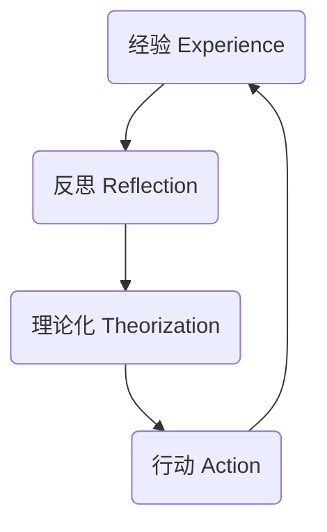

# 这样读书就够了

## 0. 引言

### 0.1 读书无用论与学习能力

- `读书无用论`的本质是，学习者不具备使学习有用的能力
- 有些书读来是为了解决问题或者提升能力，我们称之为“`致用类阅读`”
- 读书需要先确定自己的目的：（**从全科到分科，从笼而统之到分门别类，这是一门学问进化的必然**）
  - 致用类图书不用在乎是否读完，作者逻辑等，而应拆为己用，联系个人经验加以运用
  - 小说或诗集，正读或跳读都无所谓，懂或不懂也无影响，沉浸其中，物我两忘

<!--more-->>>

### 0.2 知识付费与学习能力

- 很多知识只是长得像知识而已。很多人也只是装作很爱学习而已
- 知识付费能否持续，关键在于学习能力普遍低下的状况能否得到改善

 

### 0.3 伪学习与真正的学习能力

- 四类伪学习
  - 追逐各类“干货”：如20分钟音频，10分钟视频，PPT 或者 思维导图
  - 追捧各类“大神”：听牛人分享
  - 崇拜各种“新知”
  - 沉迷于不解决实际问题的努力：听在线课程的数量，打卡，读书数量
- 学习者需要：
  - 学习者是否有足够的学习能力：**能运用起来**
  - 学习者是否有自己的知识体系：**举一反三**

### 0.4 拆书法与拆书帮

拆书”是一种学习方法论，目的是学者的需求，而不是知识的学习

### 总结

> 在阅读的绝大部分情况，我们的目的都应该是我们的需求，即我们阅读（或者说学习）想要解决的问题是什么，而不应该阅读的内容教会了什么。

## 1. 读书为什么这么难

大多数人在读书和学习中都是遇到问题就解决问题的“**头疼医头**”的方式：没时间就早起；没精力就打卡；看不懂就慢慢抠；记不住就做笔记

> 书本结论：如果学习者缺乏内化和应用知识的能力，即不能把知识转化成自己的能力，那么即使解决没时间、没精力、看不懂、记不住、看不下去等问题，也没有多大意义。

### 1.1 问题1：没时间、没精力

`生存余力理论模型（Margin in Life Theory）`：一个人总是在他需要的精力与可提供的精力之间寻求平衡。那些消耗个体精力的事情叫作**“生存负载”（Load of Life）**，而处理这些负载需要**“生存力量”（Power of Life）**。无论是生存负载还是生存力量，都由外部因素和内部因素构成。

- 生存负载（Load of Life）
  - **外部负载**主要指的就是工作，包括职场工作和没有薪水的家庭工作；
  - **内部负载**主要来自个体不断发展的生活期望：想买房，想换车，想升职，想40岁之前实现财务自由
- 生存力量（Power of Life）
  - **外部的力量**源自家庭背景、人脉资源、经济能力;
  - **内部的力量**就是个人的能力和经验

- **生存力量除以生存负载，就是麦克拉斯基强调的“生存余力”（Margin in Life）**

$$
生存余力=\frac {生存力量}{生存负载}
$$

- 对于一本书，margin过多，意味着内容过少；margin过少，读起来太累了；对于生存余力而已也是如此

### 1.2 问题2：看不懂、记不住

**看懂了，记住了，又如何？**

- **阅读本身也不能创造价值**，理解和记忆知识都不能创造价值。
- **改变行为才有可能创造价值**。并且改变行为只发生在将读来或者听来的知识内化和反思之后
- 对致用类阅读来说，重要的不是看懂，而是能和自己的经验发生联系；重要的不是记住，而是能够将知识用到自己的工作和生活中

### 1.3 问题3：看不下去

- 没必要读完一本书：任何一本书中（包括本书）都有很多你能学习但不需要学习的知识
- 读得越多，不见得用得越多
- **价值多少跟读得多少没有关系，读得少而精反而更可能去应用**

### 1.4 读书的方法论

**为了提升生存力量，方法论必须：**

- 不会成为新的生存负载
- 这种方法强调自我导向：以**学习者为中心**，而不是以书或老师为中心
- 致力于内化和应用知识:实现能力提升和行为改变，而不是致力于理解和记忆知识。

### 总结

> 这一章主要是列举了日常读书（学习）中的3个主要问题：1.没时间、没精力；2.看不懂、记不住；3.看不下去。
>
> 提出了 `生存余力理论模型` ，强调一个人要从事学习活动，不许拥有一些生存余力
>
> 对于书不需要过度追求完全看懂，理解，甚至都不需要看完，读书的价值不是在于把书看懂，不是在于理解和记忆，而且是在于读书的思考，结合实际改变日常行为。即重要的是 **学以致用**

## 2.  从“读书”到“拆书”

拆书法的理论基础就是成人教育学，落实到“RIA方法论”，**强调以学习者为中心**，一定要联系学习者的经验，解决学习者的问题，提升学习者的能力。

**拆书法有两种实践形式**：一是供个人学习的便签学习法，二是供组织学习的（由拆书家带领）RIA现场学习。

### 2.1 有效学习的五大公理

- 自我导向
  - 个体成熟的标志：从依赖性人格转换为自我导向的人格
  - 能够参与诊断自身的学习需求、规划、实施和苹果自身的学习经验
  - 主动参与而非被动接受
- 关联经验
  - 有效的学习应该是基于学习者的经验、充分利用学习者经验的
- 强调实践
  - 能力水平和意愿水平的组合，被称作个体做此事的“准备度”
  - 选择学习内容时，首先要考虑“是否用得上”，
  - 判断学习效果的标准要考虑“是否用上了”
- 聚焦于解决实际问题
  - 以解决实际问题为目标的学习
- 内在驱动
  - 成人学习更多的是受到内在因素（希望解决问题、提升能力和自我实现）而非外在因素（如考试、考核、证书）的驱动

### 2.2 RIA=阅读拆页+讲解引导+拆为己用

- `R（Reading，阅读拆页）`，拆书家请学习者阅读原书拆页。

- `I（Interpretation，讲解引导）`，拆书家讲解引导，促进学习者理解知识并关联自己。

- `A（Appropriation，拆为己用）`，拆书家催化促动，促进学习者将书中内容拆为己用。
  - A1 反思经验
  - A2 规划应用
  - A3 现场演练

### 2.3 片面追求“干货”是一种“病”

- **知识并不值钱**
  - 在《经济学原理》中提到，**一个人对任何一种物品的支付愿望都基于其边际利益，即物品产生的额外利益。反过来，边际利益又取决于一个人拥有多少这种物品。**，
  - 知识，本身很好、很重要，但是在信息时代，额外得到一份知识太容易了，其边际利益被大大降低，所以知识是好东西，但不值钱
- 案例很重要
  - 恰当的案例可以帮助学习者领悟相关知识的适用边界
  - 干货脱去的是帮助学习者内化和应用的东西，留下最不值钱的核心知识
- 自己读书时怎么做
  - 便签读书法

- 拆书法有两种实践形式：供个人学习的便签学习法和供组织学习的RIA现场学习

### 总结

> 拆书法是一种成人教育理论，落在到RIA方法论。
>
> R 阅读拆页（拆出部分内容阅读）
>
> I 讲解引导
>
> A 拆为己用（A1 反思经验； A2 规划应用；A3 现场演练）

## 3. 学习者的不同境界

### 3.1 你是哪类学者

- 初级学习者的特征
  - 书本当作权威
  - 把浏览知识的数量当作学习的收获
  - 读书当成一件高尚的、纯粹的、脱离了低级趣味的事
- 高级学习者的特征
  - 先判断学习的目标、读书的类型。对于知识类学习，他们把书当老师
  - 把致用类图书当医生
  - 学会了不对书负责，而只负责解决自己的问题、提升自己的能力：学习<-->复盘
  - 从不抱怨自己的知识储备太少

- 学习促进者的特征
  - 通过教会别人而深刻掌握某个知识
  - 把相关知识拆为己用，同时自己的学习能力、沟通能力和思维能力也能不断得到强化

### 3.2 如何正确地提问？

- 我们提问的时候，要想方设法提出能真正从中学习的问题。
- 在回答别人（孩子、学生、下属等）的提问时，提醒他不要太关注正确答案，促进他思考自己的提问
- 高级学习者怎么提问
  - 一种提问是为了得到正确答案；另一种提问是为了进行有效学习。前者常问“是什么”“为什么”，后者常问“如何”“你都考虑哪些方面”
  - 善于学习的人在反思和追问时，会尽量用“如何”来取代“为什么”
  - 善于学习的人还习惯在标准的层面向对方提问。不是问对方如何看待当下这件事，而是问对方面对这类事务时都考虑哪些因素；
- 学习促进者怎么回答提问
  - 一种回答是能够给出正确答案，另一种回答是能够促进正确思考。
  - 扼杀问题的最大凶手是什么？不是粗暴的打断，而是正确的答案。

### 总结

> 学会提问，在面对别人的问题时，学会提问让他去思考发现答案；面对学习和阅读时，学会提问自己来达到学以致用

## 4. 便签学习法：培养全新的思维模式

便签法的基本应用

### 4.1 明确目标：提升学习力

便签法的目标是用最简单的工具和方法提高职场人的学习效果和学习能力

### 4.2 拆解原则：反求诸己

- 原则
  - 自我导向
  - 让书对你负责（学习者为中心）
  - 应用
  - 采用简单的工具：便签

### 4.3 随处可见的辅助工具

- 使用三种不同颜色的便签，分别用来做3类笔记（I、A1、A2）：
  - 第1类拆解（I）：用自己的语言重述信息。
  - 第2类拆解（A1）：描述自己的相关经验。
  - 第3类拆解（A2）：我的应用（目标与行动）
- 一组多色指示标签
- 一支笔

### 4.4 “拆书”七步曲

- 第一步，确定你要读的是**致用类的图书**，这是拆书法的**适用边界**
- 第二步，快速阅读，遇到重点提问：这对我有多重要？
- 第三步，在I便签上用自己的语言简要重述相关信息，也可以是总结自己得到的启发、有价值的提醒。写好后贴在相应的书页。
- 第四步，针对书中的某个信息，问问自己有没有相关的经历，是否听说或者见到过类似的事情，写在一张 A1 便签上，贴到I便签旁边。
- 第五步，规划今后如何应用。尽量先考虑应用的目标，再写下达到目标应实施的行动。写在一张 A2 便签上，也贴在书页上。
- 第六步，在贴了便签的书页旁，贴一张指示标签。提醒自己这一页有自己的学习资料。
- 第七步，看完一本书后，把所有的 A2 便签拿出来贴在冰箱或墙上，提醒自己落实行

### 4.5 便签使用贴士

- 第一点，若原书内容简明易懂，则可以不用I便签，只需在重点内容下面加下划线或在侧面加边划线就可以。

- 第二点，想好再写，要有的放矢，而不是笔底生花，内容请尽量控制在一张便签之内。有时I便签和A1便签上的文字会较多，那么可以再加一张便签。为了避免感慨内容泛滥，A2便签尽可能清晰、精练。如果你想到3个应用点或行动计划（每个行动都要对应一个目标），那么就写3张A2便签吧。

- 第三点，指示标签的作用相当于升级版书签，用于提醒自己哪几页贴过便签。尤其是你拿出A2便签之后，可能过一段时间又希望把贴在墙上的A2便签再放回书里。鼓励你尝试一套适合自己的标签使用规则，比如黄色指示标签表示这一页便签对我非常有价值，绿色指示标签表示要尽快行动，橙色指示标签意味着需要再次加工便签……

### 4.6 切勿陷入误区

**I：重述知识的标准**

- 1.诠释：基本用自己的语言，不直接引用原文语句。
- 2.准确：对原文相关知识点解读准确。
- 3.清晰：逻辑清晰，文字精练。
- 4.致用：将原文知识点总结或加工成具体的操作方法或建议步骤。

**I便签常见误区：附会旧知**

- 这种“不就是××嘛”的反应
- 对着你写下的I便签问问自己：若是没读那段原文的话，I便签写下的这些我知不知道？如果答案是“我早就知道”，那你很可能就是在用旧知附会新知了。

----

**A1：内化知识的标准**

- 1.鲜活：是自己亲身经历的，亲眼所见、亲耳所闻的认知。
- 2.故事：相关叙事要素基本完整，能够清晰地体现出起因和结果。
- 3.对应：和原文或I便签的4个要素对应，使之成为贴切的案例。
- 4.反思：无论想到的是成功还是失败的经验，都能帮助自己更深入地理解这个经验，也加深了对原文信息的认知。

**A1便签常见误区：泛泛而谈**

- 泛泛而谈，不讲具体事例

----

**A2：应用知识的标准**

- 1.目标：是否规划了目标？目标是否符合SMART法则[插图]？
- 2.行动：行动是否可以拉近现状与目标的距离？具体行动步骤如何？行动人是谁？在哪里？行动何时开始？频率如何？
- 3.关联：是否使用了原文信息或I便签的方法。
- 4.可控：都是自己能做到或能推动他人做到的吗？可以量化做的程度吗？行动显性化吗？

**A2便签常见误区：决心泛滥或感慨万千**

- 在写A2便签前，应该先定目标。实现目标是对行动的最佳奖赏
- 参考SMART法则。

----

`便签法的微信训练法`

在接下来的1个月内，严格要求自己不能在朋友圈里直接转发任何内容。当你在微信订阅号、朋友圈或某个群看到一篇不错的文章想要转发时，让自己停下来，问问自己：

我能加上自己的重述再转发吗？

重述的时候能体现一下前因后果或适用边界吗？

我能补充点儿自己的相关经验吗？

我能加上一个自己的应用或行动吗？

只要能想到或加上一点儿自己的东西，那你就得到了锻炼。如果对着手机想5分钟还是想不到呢？实在想不出来就放弃转发吧，这篇文章跟你的关系没那么大。同时，那5分钟也没有浪费，在这期间你的大脑得到了高效练习，对应I、A1、A2的思维肌肉也得到了强化训练

### 总结

> 便签法的简单实用，在阅读过程中，对自己有用的知识进行一下三步操作：
>
> - 第1类拆解（I）：用自己的语言重述信息。
> - 第2类拆解（A1）：描述自己的相关经验。
> - 第3类拆解（A2）：我的应用（目标与行动）

## 5. 打造学习力的三个维度

便签法的升级，学习能力从一维（内化与应用知识）拓展到三维（怎么在移动阅读中学习，通过经验学习）

### 5.1 学习力是元能力

无论能力的谱系多么复杂，有一项能力是最特殊的，那就是学习能力。因为学习能力是元能力——关于能力的能力

### 5.2 解读知识：为信息添加上下文

- 所有知识都算信息，但并非所有的信息都是知识
- 知识的结构化比较清晰，具备“可证伪性”，鼓励受众自己判断
  - 一天要喝8杯水
  - 在肾功能没有问题的前提下，一位成年人一天喝2 000毫升水对身体有益

----

**信息进行分析和整理**

**分析：**分析信息对自己的重要程度，以便决定是否学习

**整理：**将信息结构化，以便形成知识

- **分析信息**的关键是追问前因后果
  - 前（前车可鉴）：为什么这件事对我重要？作者是怎么引出这个信息的？
  - 因（相因相生）：作者提出了哪些关于原因的假设？是怎么验证或排除这些假设的？还有其他可能性吗？
  - 后（以观后效）：若依从信息去做之后会怎样？对我的好处（效用）是什么？
  - 果（自食其果）：不这么做的后果是什么？不改变的问题有多严重？

- **整理信息**的关键是明确适用边界
  - 适（适得其反）：有没有相反的观点？有没有不支持这个观点的实例？
  - 用（使用条件）：要这样做得具备哪些条件（考虑成本收益，考虑态度能力……）？什么情况下是不管用的？
  - 边（旁敲边鼓）：从前有没有类似的（或看起来差不多的）信息？其他领域/行业/作者如何看待类似的问题？
  - 界（楚河汉界）：无论是相反的还是类似的信息，和这个信息的真正区别是什么？交界在哪里？

### 5.3 I便签：辨别知识和信息

升级 I便签，由`重述知识的标准` 升级为`辨别知识和信息`（需要尽量在I便签中刻意体现你对信息的前因后果和适用边界的思考）

### 5.4 不要急于质疑和挑战

- 遇到新信息时，在分析阶段（问前因后果）主要**关注信息的有用**、有价值之处，到了整理阶段（问适用边界）**再去质疑和挑战**。
- 看书比看手机更容易有收获，并不是因为书中信息更好、更正确或更系统，而是书中的内容能更有效地帮学习者理清前因后果和适用边界

### 5.5 如何借助A1、A2便签来追问和反思？

- 对成人学习来说，学习的起点往往是因为遇到了问题
- 有些问题，前因后果千差万别，没有一本书能提供现成的答案；适用边界因人而异，不可能有人给出解决方案
- 从知识或信息中学习（即`Knowledge`，称为K机制）并非人类学习的唯一机制，学习的另一维度是从经验中学习（即`Experience`，称为E机制）。
- 学习的最高境界是“知行合一”：`知之真切笃行处即是行，行之明觉精察处即是知`

----

**经验学习圈模型**

> `经验学习圈模型`：学习的起点是人们的经验（`Experience`）,然后是对经验进行反思（`Reflection`），再系统化和理论化反思的结果，也就是学习的第三阶段——“理论化”（`Theorization`），最后是“行动”（`Action`）。行动中如果出现新问题，则开始又一轮的学习圈，如此循环。

**便签法实现经验学习圈模型**

- A1便签：写下自己的问题，然后对这个问题进行反思和追问，问有洞察力的问题
  - 如前因后果、适用边界
  - 一定是自己亲历的问题，不能是想象的、理论的问题
  - 比较紧迫或重要的问题
  - 简短一点
- I便签： 写下A1标签追问后重新定义的问题
  - 对A1反思和追问，把“真正需要解决的问题”写在I便签上
  - I便签用以重述信息，其实是为了澄清问题、理解问题、找到根源，从而重新定义问题。
- A2便签：规划并行动
  - 目标性、行动性、关联性、可控性
- 在 A2 落实过程中，遇到问题继续冲 A1 开始，不断循环

有洞察力的问题总是需要不同的视角和不同的假设。如果你实在没有思路，可以从如下8类提问开始：

- 追问前因后果
  - 前（前车可鉴）：为什么这件事对我重要？是怎么出现这个问题的？
  - 因（相因相生）：都有哪些关于原因的假设？怎么验证或排除这些假设？还有其他人能帮我思考，给出更多选择或可能性吗？
  - 后（以观后效）：若这个问题解决了，最好的结果是什么？那是我期待的吗？
  - 果（自食其果）：如果我什么都不做，会发生什么？

- 明确适用边界
  - 适（适得其反）：有没有人不同意我对原因的假设？有没有不符合这个假设的实例？
  - 用（使用条件）：要解决这个问题，需要具备哪些条件（考虑成本收益，考虑态度能力……）？这件事可以用其他什么方式来完成？
  - 边（旁敲边鼓）：有没有可供借鉴的情况？其他领域/行业/人如何解决类似问题？
  - 界（楚河汉界）：无论是不同的意见还是类似的问题，它们和我的思路的真正区别是什么？交界在哪里？

### 总结

> 升级便签法：
>
> 从A1开始，明确问题，反思并重定义问题记录为I，在A2落实行动，遇到问题继续中A1开始。

## 6. 构建属于你自己的知识体系

一组便签到多组便签，相互配合、相互对接、相互界定，你的知识体系自然会生长

### 6.1 知识管理：被加工的碎片化信息

